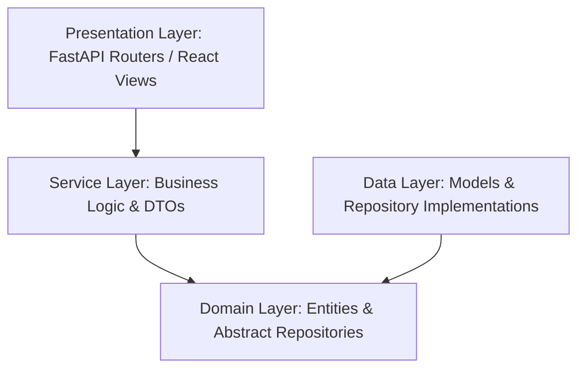

# System Architecture Design

StadiumOS AI is designed using **Clean Architecture** patterns, ensuring a decoupling of business rules from data storage mechanisms, frame components, and UI controls.

---

## 🏗️ Architectural Layers

### 1. Domain Layer (`features/[feature_name]/domain/`)
- Contains the fundamental business entities and abstract repository contracts.
- Independent of database tools, ORM classes, or web request context.

### 2. Service Layer (`features/[feature_name]/services/`)
- Houses the core use cases, workflows, and transaction orchestrators.
- Translates entities into Data Transfer Objects (DTOs) for the Presentation layer.

### 3. Data Layer (`features/[feature_name]/data/`)
- Implements abstract repository interfaces using SQLAlchemy ORM.
- Handles database model schemas, queries, and data serialization.

### 4. Presentation Layer (`features/[feature_name]/presentation/`)
- Defines REST routes, validation schemas (Pydantic / TypeScript), and controllers.
- Parses authentication state and manages error boundaries.
