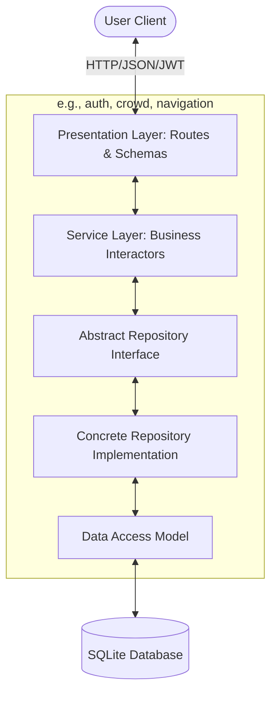

# StadiumOS AI 🏟️ - FIFA World Cup 2026

StadiumOS AI is a production-grade full-stack digital twin and AI copilot platform engineered to optimize venue operations, crowd movements, emergency communications, volunteer logistics, and environmental metrics for the FIFA World Cup 2026.

---

## 🏗️ Architecture & System Design

StadiumOS AI is designed following **Clean Architecture** principles, enforcing strict Separation of Concerns and decoupling data stores from core business domains:



### Key Architectural Standards:
- **SOLID, KISS & DRY**: Core logic is clean python and TypeScript. No duplicate mapping logic.
- **Repository Pattern**: Prevents database frameworks (like SQLAlchemy) from leaking into HTTP presentation controllers.
- **Dependency Injection**: Services receive abstract repository references. FastAPI resolves SQL dependencies on HTTP routes, facilitating mock testing.
- **Centralized Handlers**: Centralized custom exceptions (HTTP mapping) and structured transaction logging.

---

## 📁 Repository Structure
```
├── backend/
│   ├── app/
│   │   ├── core/              # Shared Cross-Cutting Concerns
│   │   │   ├── config/        # Centralized settings
│   │   │   ├── database/      # Database connections and sessions
│   │   │   ├── exceptions/    # Global exception handler & domain errors
│   │   │   ├── logging/       # Structured logs config
│   │   │   └── middleware/    # Rate limiters & logging middlewares
│   │   │
│   │   ├── features/          # Feature-Based Modules
│   │   │   ├── [feature_name]/# e.g., auth, crowd, navigation, emergency, volunteer, sustainability, reports, assistant
│   │   │   │   ├── domain/    # Pure entities & repository contracts
│   │   │   │   ├── data/      # Data access schemas & SQLAlchemy models
│   │   │   │   ├── services/  # Domain business logic & DTOs
│   │   │   │   └── presentation/# FastAPI Routers & Pydantic request validations
│   │   │
│   │   ├── tests/             # Pytest unit and integration suites
│   │   └── main.py            # API lifecycle bootstrap
│   ├── Dockerfile
│   └── requirements.txt
│
├── frontend/
│   ├── src/
│   │   ├── core/              # Global Providers & Configurations
│   │   │   ├── config/        # API Constants
│   │   │   ├── context/       # Auth & Accessibility Providers
│   │   │   └── types/         # Centralized TypeScript definitions
│   │   │
│   │   ├── shared/            # Reusable UI Controls (independent of features)
│   │   │   └── components/    # Header, ErrorBoundary, global layout UI
│   │   │
│   │   ├── features/          # Feature Modules (contains view components)
│   │   │   ├── auth/          
│   │   │   ├── navigation/    # InteractiveMap SVG
│   │   │   ├── assistant/     # ChatWidget voice assistant
│   │   │   └── ...
│   │   │
│   │   └── app/               # Next.js App Router folders (page routing links)
│   ├── tsconfig.json
│   ├── package.json
│   └── Dockerfile
```

---

## 🚀 Setup & Installation

### 🐋 Method 1: Docker Compose (Recommended)
Spin up both backend and frontend containers instantly:
```bash
docker-compose up --build
```
- **Frontend App**: [http://localhost:3000](http://localhost:3000)
- **FastAPI OpenAPI Documentation**: [http://localhost:8000/api/v1/docs](http://localhost:8000/api/v1/docs)

---

### 💻 Method 2: Local Manual Setup

#### 1. Backend Server Setup
Ensure Python 3.10+ is installed:
```bash
cd backend
python -m venv venv
source venv/Scripts/activate # On Windows: venv\Scripts\activate
pip install -r requirements.txt
```
To load the real-time AI service, append your Gemini key inside a `.env` file (or let it fallback to rules engine):
```env
GEMINI_API_KEY=your-gemini-api-key
DATABASE_URL=sqlite+aiosqlite:///./stadium_os.db
SECRET_KEY=yoursecretkeyhere
```
Run development server:
```bash
uvicorn app.main:app --reload --port 8000
```

#### 2. Frontend Next.js Setup
Ensure Node.js 18+ is installed:
```bash
cd ../frontend
npm install
```
Configure backend url connection env variables inside `.env.local`:
```env
NEXT_PUBLIC_API_URL=http://localhost:8000
```
Run development server:
```bash
npm run dev
```

---

## 🧪 Testing and Quality Control

### Run Backend Tests (Pytest)
```bash
cd backend
python -m pytest --cov=app --cov-report=term-missing
```
*Note: Target code coverage is set to >=90%. Tests cover auth tokens, RBAC exceptions, mapping waypoint math, prompt injection validation, and mock fallback routines.*

### Run Frontend Component Tests (Jest)
```bash
cd frontend
npm test
```

---

## 📊 API Endpoint Documentation

| Category | HTTP Method | Endpoint | Description | Role Clearance |
| -------- | ----------- | -------- | ----------- | -------------- |
| **Auth** | POST | `/api/v1/auth/signup` | Register a new user | All |
| **Auth** | POST | `/api/v1/auth/login` | Login and acquire JWT Token | All |
| **Auth** | GET | `/api/v1/auth/me` | Fetch user profile | All |
| **Crowd** | GET | `/api/v1/crowd/alerts` | Query active crowd warnings | All |
| **Crowd** | POST | `/api/v1/crowd/alerts` | Log new sector congestion alerts | Staff (Organizer/Security/Vol) |
| **Crowd** | GET | `/api/v1/crowd/prediction`| Fetch hourly congestion forecasts | All |
| **Maps** | GET | `/api/v1/navigation/nodes` | List map coordinate landmarks | All |
| **Maps** | GET | `/api/v1/navigation/route` | Calculate optimized waypoint routes | All |
| **Emergency**| POST | `/api/v1/emergency/incidents`| Log emergency and write AI response | All |
| **Emergency**| PUT | `/api/v1/emergency/incidents/{id}/resolve`| Close out emergency log | Security / Organizer |
| **Volunteer**| GET | `/api/v1/volunteer/tasks` | Fetch duties checklists | Staff (Organizer/Volunteer) |
| **Volunteer**| PUT | `/api/v1/volunteer/tasks/{id}`| Change task assignment or status | Staff (Organizer/Volunteer) |
| **Green OS** | GET | `/api/v1/sustainability/summary`| Aggregates power & waste metrics | All |
| **Reports** | POST | `/api/v1/reports/generate`| Generate operational report using AI | Organizer |

---

## 🧠 Core System Assumptions
1. **Database Backend**: Utilizes SQLite via `aiosqlite` to allow immediate, zero-dependency executions locally.
2. **AI Client Fallbacks**: If `GEMINI_API_KEY` is empty, missing, or throws connection timeout issues, the backend switches to a localized, rules-based operational knowledge matching engine.
3. **CORS rules**: Standard CORS headers permit frontend domains to retrieve API calls from external systems.
4. **JWT Lifespan**: Access tokens auto-expire 60 minutes after generation.

---

## 📄 License & Contributing Policies
- See [LICENSE](file:///e:/Challenge%204/LICENSE) for terms.
- Consult [CONTRIBUTING.md](file:///e:/Challenge%204/CONTRIBUTING.md) for style compliance.
- Review [SECURITY.md](file:///e:/Challenge%204/SECURITY.md) for vulnerability reports.
- Track updates in [CHANGELOG.md](file:///e:/Challenge%204/CHANGELOG.md).
